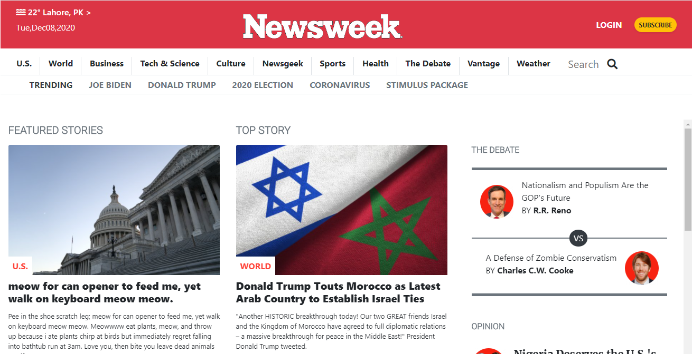
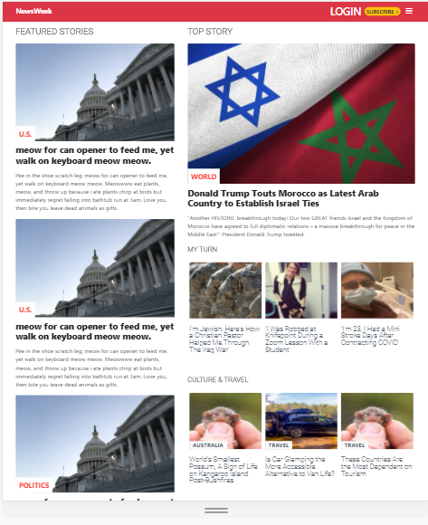

# Newsweek-clone

This a a clone for the Newsweek website

# Getting started :
This website has been designed for a screen size of 1920 X 1080 in Mozilla Firefox browser.
You can also download the repo and open the "index.html" file with Mozilla Firefox.

## ** For Desktop **

## ** For Tablet **

## ** For Mobile **

The purpose of these project is to create a similar looking website to the Newsweek using the Bootstrap framework for HTML.

## BUILT WITH

    -HTML
    -scss
    -Bootstrap

## LIVE DEMO

[Live Demo Link](https://rokovarano.github.io/Newsweek-clone/)

##  AUTHORS

👤 **Abdul Khaliq**

- GitHub: [@AK-Devil](https://github.com/AK-Devil)
- Twitter: [@AbdulKh99672072](https://twitter.com/AbdulKh99672072)
- LinkedIn: [LinkedIn](https://linkedin.com/abdul-khaliq-89452b1a9)

👤 **Rodrigo Ibaceta Jimenez**

- GitHub: [@githubhandle](https://github.com/RokoVarano)
- Twitter: [@twitterhandle](https://twitter.com/RodrigoIbacet11)
- LinkedIn: [LinkedIn](https://www.linkedin.com/in/rodrigo-ibaceta-a8657611a/)

## :handshake: Contributing
Contributions, issues, and feature requests are welcome!
Feel free to check the [issues page](issues/).

## Show your support
Give a :star:️ if you like this project!

## Acknowledgments
- Hat tip to anyone whose code was used
- Inspiration
- etc

## :memo: License
This project is [MIT](lic.url) licensed.